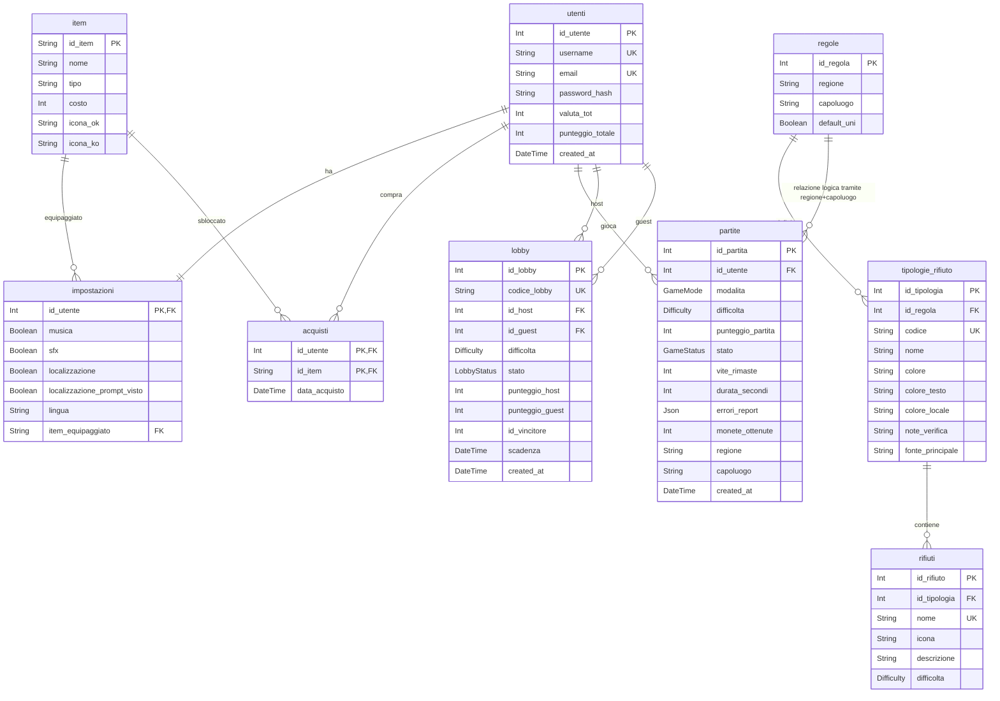

# Database TrashDash: Schema ER e Descrizione

Questo documento descrive il database reale definito in `Trash_Dash_backend/prisma/schema.prisma`.

## Schema ER

## Come Entrano le Regole Nelle Partite

Le tabelle `regole`, `tipologie_rifiuto` e `rifiuti` entrano nel gameplay prima e durante la partita:

- quando la localizzazione è `OFF`, il frontend/backend usano la regola `Standard UNI 11686`;
- quando la localizzazione è `ON`, la posizione viene convertita in `regione` e `capoluogo`;
- il catalogo localizzato recupera i cassonetti da `regole` + `tipologie_rifiuto`;
- gli oggetti da smistare vengono presi/adattati da `rifiuti`;
- quando la partita finisce, la tabella `partite` salva `regione` e `capoluogo` come snapshot della regola usata.

Quindi `partite` non ha una foreign key fisica verso `regole`, ma contiene `regione` e `capoluogo`, che permettono di sapere quale set di regole era applicato. Nel grafico questa è indicata come relazione logica.

## Dove Si Trova la Tabella Excel

Il file Excel `tabella_colori_raccolta_corretta.xlsx` non viene salvato nel database come file o come tabella chiamata `excel`.

I suoi dati sono stati trasformati così:

- foglio `Tabella corretta`: trasformato nel seed backend `Trash_Dash_backend/prisma/seed.ts`, costante `RULES`;
- ogni riga capoluogo/regione diventa una riga in `regole`;
- ogni colore per frazione diventa una riga in `tipologie_rifiuto`;
- note e fonti del file Excel diventano `note_verifica` e `fonte_principale`;
- una copia di fallback è presente nel frontend in `Trash_Dash_frontend/src/domain/location/localRules.js`, così il gioco degrada bene anche se il backend non risponde.

In pratica il file Excel è una sorgente dati di partenza; il database usa una forma normalizzata più adatta al gioco.

## Tabelle e Contenuto

### `utenti`

Contiene gli utenti registrati. Campi principali:

- `username`: nome visibile;
- `email`: credenziale unica;
- `password_hash`: password cifrata, mai in chiaro;
- `valuta_tot`: monete dell'utente;
- `punteggio_totale`: punteggio usato in classifica;
- `created_at`: data di creazione.

L'account `admin@admin.admin` resta nel DB per test, ma viene escluso dalla classifica dall'endpoint backend.

### `impostazioni`

Contiene una riga per utente con preferenze:

- musica;
- effetti sonori;
- localizzazione;
- prompt localizzazione già visto;
- lingua;
- item estetico equipaggiato.

### `item`

Contiene gli oggetti cosmetici dello shop:

- id item;
- nome;
- tipo;
- costo;
- icona versione vittoria/sana;
- icona versione sconfitta/appassita.

### `acquisti`

Tabella ponte molti-a-molti tra `utenti` e `item`.

Serve per sapere quali cosmetici sono stati sbloccati da ciascun utente.

### `partite`

Contiene lo storico delle partite concluse o abbandonate:

- utente, se registrato;
- modalità `SINGLE` o `BATTLE`;
- difficoltà;
- punteggio;
- stato vittoria/sconfitta/abbandono;
- vite rimaste;
- durata;
- errori del report didattico;
- monete ottenute;
- regione e capoluogo applicati alla partita.

`regione` e `capoluogo` sono il collegamento informativo con le regole usate.

### `lobby`

Contiene le sfide scontro:

- codice lobby;
- host;
- guest;
- difficoltà;
- stato;
- punteggio host;
- punteggio guest;
- vincitore;
- scadenza.

`id_vincitore` è salvato come valore, ma nello schema attuale non è modellato come foreign key Prisma esplicita.

### `regole`

Contiene i set di regole territoriali:

- `Standard UNI 11686 / Standard`;
- le 20 regioni/capoluoghi dal file Excel.

Ogni riga rappresenta una zona/regola applicabile.
La coppia `regione + capoluogo` è unica nello schema Prisma.

### `tipologie_rifiuto`

Contiene i cassonetti/frazioni per ciascuna regola:

- carta;
- multimateriale;
- umido;
- vetro;
- secco;
- rifiuti speciali.

Qui vivono colori, nomi localizzati, note e fonti.

### `rifiuti`

Contiene gli oggetti smistabili associati alle tipologie:

- nome;
- icona;
- descrizione;
- difficoltà.

Questi dati permettono al gioco di generare oggetti coerenti con la difficoltà e con la regola locale attiva.

## Stato Verificato Del DB Locale

Durante l'ultima verifica, il database locale usato dall'app conteneva:

| Tabella | Righe |
|---|---:|
| `utenti` | 1 |
| `impostazioni` | 1 |
| `item` | 28 |
| `acquisti` | 28 |
| `partite` | 0 |
| `lobby` | 0 |
| `regole` | 21 |
| `tipologie_rifiuto` | 126 |
| `rifiuti` | 6321 |
