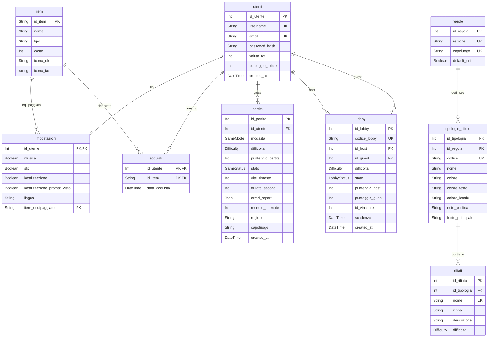

# Grafico ER Database TrashDash

```mermaid
erDiagram
  utenti {
    Int id_utente PK
    String username UK
    String email UK
    String password_hash
    Int valuta_tot
    Int punteggio_totale
    DateTime created_at
  }

  impostazioni {
    Int id_utente PK,FK
    Boolean musica
    Boolean sfx
    Boolean localizzazione
    Boolean localizzazione_prompt_visto
    String lingua
    String item_equipaggiato FK
  }

  item {
    String id_item PK
    String nome
    String tipo
    Int costo
    String icona_ok
    String icona_ko
  }

  acquisti {
    Int id_utente PK,FK
    String id_item PK,FK
    DateTime data_acquisto
  }

  partite {
    Int id_partita PK
    Int id_utente FK
    GameMode modalita
    Difficulty difficolta
    Int punteggio_partita
    GameStatus stato
    Int vite_rimaste
    Int durata_secondi
    Json errori_report
    Int monete_ottenute
    String regione
    String capoluogo
    DateTime created_at
  }

  lobby {
    Int id_lobby PK
    String codice_lobby UK
    Int id_host FK
    Int id_guest FK
    Difficulty difficolta
    LobbyStatus stato
    Int punteggio_host
    Int punteggio_guest
    Int id_vincitore
    DateTime scadenza
    DateTime created_at
  }

  regole {
    Int id_regola PK
    String regione UK
    String capoluogo UK
    Boolean default_uni
  }

  tipologie_rifiuto {
    Int id_tipologia PK
    Int id_regola FK
    String codice UK
    String nome
    String colore
    String colore_testo
    String colore_locale
    String note_verifica
    String fonte_principale
  }

  rifiuti {
    Int id_rifiuto PK
    Int id_tipologia FK
    String nome UK
    String icona
    String descrizione
    Difficulty difficolta
  }

  utenti ||--|| impostazioni : "ha"
  item ||--o{ impostazioni : "equipaggiato"
  utenti ||--o{ acquisti : "compra"
  item ||--o{ acquisti : "sbloccato"
  utenti ||--o{ partite : "gioca"
  utenti ||--o{ lobby : "host"
  utenti ||--o{ lobby : "guest"
  regole ||--o{ tipologie_rifiuto : "definisce"
  tipologie_rifiuto ||--o{ rifiuti : "contiene"
```
